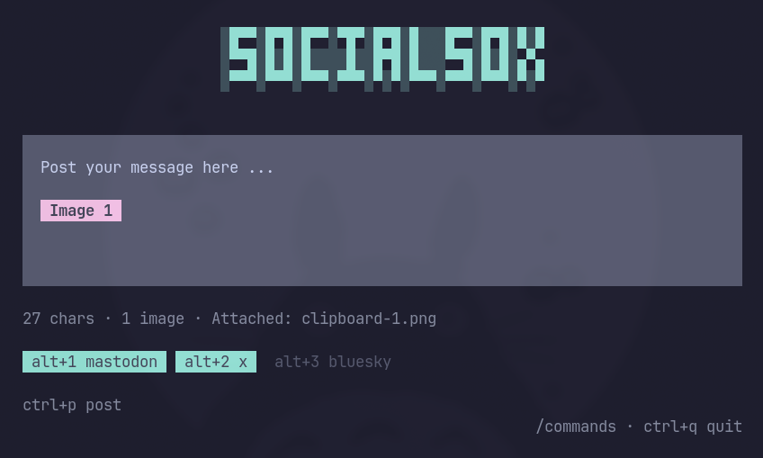

# SocialSox TUI

A fast, compose-first terminal app for crossposting to Mastodon, X, and Bluesky with image/video support.



MIT License.

## Features

- Crosspost to Mastodon, X, Bluesky in one action
- Styled composer box for message writing on the POST screen
- Attach up to 4 image/video files
- Concurrent posting with per-platform results
- Credentials stored in system keychain (`keytar`) with encrypted file fallback
- Local config and fallback secrets are encrypted at rest

## Security model

- Preferred storage is your OS keychain via `keytar`.
- If keychain access fails, the app falls back to an encrypted file in `~/.config/socialsox-tui/`.
- The fallback encryption key is derived from local machine/user properties. This protects against casual disclosure, but should not be treated as strong protection against a local attacker with account-level access.
- Keep your OS account secure and use full-disk encryption for stronger protection.

## Project scope

- This repo is currently source-first and not intended for npm publishing.
- Use it by cloning and running from source (`npm install`, then `npm start`).

## Known limitations

- No formal automated test suite yet. CI currently runs a smoke check only.
- Keychain support depends on local system setup. If keychain access fails, credentials fall back to local encrypted storage.
- The fallback encryption key is machine/user-derived and is not a substitute for full system security controls.
- Clipboard image paste on Linux requires `wl-paste` (Wayland) or `xclip` (X11).
- X posts are limited to 280 characters and media handling may change with upstream platform/API behavior.
- Bluesky video posting depends on current ATProto backend capabilities and may vary over time.

## Run

```bash
npm install
npm start
```

## Getting Started

Switch to the **CONFIG** screen (`tab`) and fill in your credentials. They are stored in the system keychain with an encrypted file fallback.

### Mastodon

1. Log in to your instance (e.g. `mastodon.social`)
2. Go to **Settings → Development → New Application**
3. Give it a name and select these scopes: `read:accounts`, `read:statuses`, `write:media`, `write:statuses`
4. Submit, then copy your **access token**
5. In the TUI, enter your **instance URL** (just the domain like `https://mastodon.social`, not your profile URL) and the **access token**

### Bluesky

1. Log in to Bluesky
2. Go to **Settings → App Passwords**
3. Create a new app password
4. In the TUI, enter your **handle** (e.g. `username.bsky.social`) and the **app password**

### X (Twitter)

1. Go to the [X Developer Portal](https://developer.x.com/en/portal/dashboard)
2. Create a project and app (or use an existing one)
3. Open your app → **Settings** → **User authentication settings**
4. Enable **OAuth 1.0a** (choose "Web App, Automated App or Bot")
5. Set **App permissions** to **Read and Write**
6. Add any valid URLs for Callback / Website (these won't be used, but X requires them)
7. Save, then go to the **Keys and Tokens** tab
8. **Regenerate** your Access Token and Access Token Secret after changing permissions
9. In the TUI, enter all 4 credentials:
   - **API Key** (Consumer Key)
   - **API Secret** (Consumer Secret)
   - **Access Token**
   - **Access Token Secret**

> **X Troubleshooting**: If you see an "oauth1 app permissions" error, double-check that OAuth 1.0a is enabled with "Read and Write", then regenerate your Access Token and Access Token Secret. Old tokens do not work after permission changes.

## Controls

### Global

- `Tab` — switch between POST and CONFIG screens
- `Esc` — stop editing or quit
- `Ctrl+Q` — quit (saves config)
- `Alt+1` / `Alt+2` / `Alt+3` — toggle Mastodon / X / Bluesky
- `s` — save config/credentials
- `i` — import credentials from desktop SocialSox export
- `p` — post to enabled platforms

### POST screen

- `e` — edit message
- `a` — edit attachment paths
- `Ctrl+P` — submit post
- `Ctrl+X` — clear all media attachments
- `v` or `Ctrl+V` — paste clipboard image as media blob
- `Ctrl+C` — copy message to clipboard
- `m` — enter POST screen (useful from CONFIG)
- `Enter` — newline in message, or finish editing other fields
- Left/Right arrows — move cursor within message (editing)

### CONFIG screen

- Up/Down arrows — move between fields
- `Enter` — edit selected field or toggle boolean
- `Space` — toggle boolean fields (enabled/disabled)

## Media Notes

- Provide attachment paths as a comma-separated list.
- Max 4 files.
- Images are auto-compressed for X when needed.
- Bluesky video support depends on current ATProto backend support.
- While editing the `Message` field, you can paste `data:image/...;base64,...` blobs directly and they are auto-attached.
- On Linux, `v` reads image blobs from clipboard using `wl-paste` (Wayland) or `xclip` (X11).
- If your terminal inserts placeholders like `[Image 1]` on paste, the app auto-detects that and pulls the real image blob from system clipboard.
- **Clipboard paste (images vs videos)**: On Wayland, `Ctrl+V` pastes text content (which may include image paths), while `Ctrl+Shift+V` performs a raw paste of binary data. Images often have a text representation so `Ctrl+V` works; videos usually don't, so use `Ctrl+Shift+V` for video content.

## Reset config

```bash
npm start -- --reset-config
```

## Import from desktop SocialSox

The TUI can ingest the `socialsox-credentials.json` export format from the original [desktop SocialSox app](https://github.com/burninc0de/socialsox).

- On startup, it auto-loads from this file if no local config/secrets are set.
- Press `i` in the TUI to force import at any time.
- It only reads from: `~/.config/socialsox-tui/socialsox-credentials.json`

Once imported, the credentials are re-encrypted into the app's own storage (keychain + encrypted file). The raw `socialsox-credentials.json` can then be safely deleted.

## Warranty and liability

This software is provided as-is, without warranties or guarantees of any kind.

By using this software, you accept that the authors and contributors are not liable for any claims, damages, losses, data loss, service disruption, or other liability arising from its use.

For full legal terms, see the MIT license in `LICENSE`.
